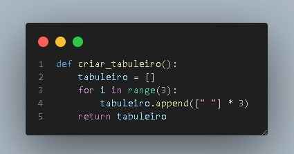
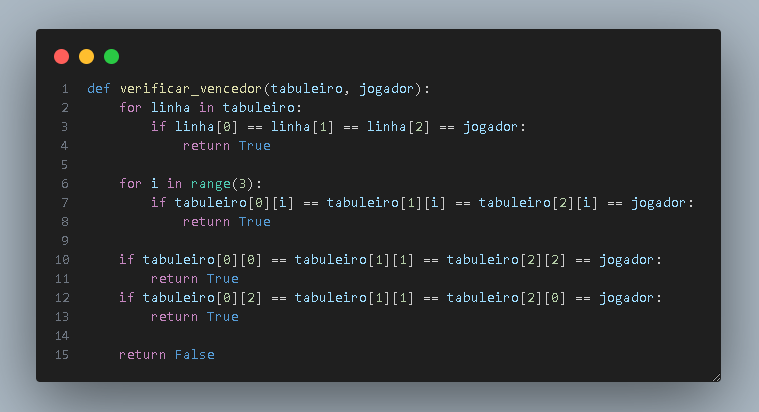

# Descrição

Refatorei o código para melhorar a legibilidade e organização.
Simplifiquei a verificação de vencedor.
Tratei entradas inválidas.
Atualizei a pontuação e salvei em arquivo.

## Ajustes

A versão original criava o tabuleiro usando um loop “for” e aninhava outro loop “for” dentro dele para preencher cada linha
com espaços vazios.
A versão refatorada utiliza uma única linha de código com "list comprehension", tornando o processo mais conciso e fácil de
entender.

a versão depois utiliza a função all() para verificar todas as casas em uma linha ou coluna, o que melhora a legibilidade e reduz a redundância.

## Implementa

-Função criar_tabuleiro():
Utiliza list comprehension para criar um tabuleiro vazio.

-Função verificar_vencedor(tabuleiro, jogador):
Simplifica a verificação de vitória nas linhas e colunas.
Verifica as diagonais.

-Tratamento de entrada inválida:
Verifica se a jogada está dentro dos limites do tabuleiro e se a posição está vazia.

-Atualização da pontuação:
Incrementa a pontuação do jogador vencedor.

-Salvamento da pontuação em arquivo:
Usa JSON para salvar e carregar a pontuação em um arquivo chamado “pontuacao.json”.

-Organização do fluxo do jogo:
Permite jogar novamente após o término da partida.

## Tipo de mudança (marcar as alternativas que se encaixam)

- [x] Nova Funcionalidade: Refatorei o código para melhorar a legibilidade e organização, além de adicionar tratamento de entrada inválida e atualização da pontuação.Implementei uma nova funcionalidade
- [x] Correção de bug: Corrigi um bug na pontuação que quando tinha um espaçamento fazia dar erro no código
- [x] Melhoria de código: Melhorei a qualidade do código

Checklist:
[x] Organização do Código:
Refatorei o código para melhorar a legibilidade e organização.
Utilizei "list comprehension" para criar o tabuleiro vazio.
Simplifiquei a verificação de vitória nas linhas e colunas.
Tratei entradas inválidas.
Atualizei a pontuação e salvei em arquivo.

[x] Testes e Exaustividade:
Testei exaustivamente o jogo, incluindo diferentes cenários (vitória, empate, jogadas inválidas).
Verifiquei se a pontuação é atualizada corretamente.

[x] Revisão do Código:
Revisei o código para garantir que não há erros ou problemas.

[x] Compatibilidade e Estabilidade:
Verifiquei se as mudanças não afetam outras funcionalidades.
Garanti que o jogo funciona corretamente em diferentes sistemas e ambientes.
